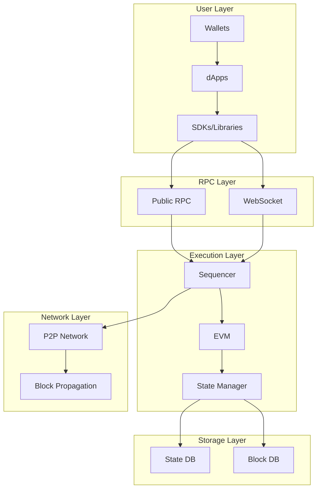
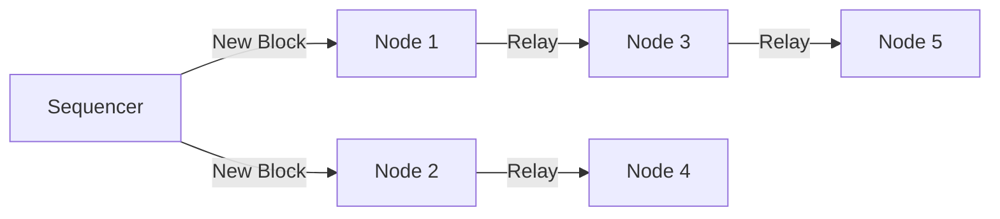

## Overview

Paxeer Network is a high-performance EVM-equivalent blockchain designed for scalability, security, and developer experience.

## Core Components

<CardGroup cols={2}>
  <Card title="Execution Layer" icon="microchip">
    EVM-compatible execution environment
  </Card>
  <Card title="Consensus Layer" icon="handshake">
    Block production and validation
  </Card>
  <Card title="Networking Layer" icon="network-wired">
    P2P communication and data propagation
  </Card>
  <Card title="Storage Layer" icon="database">
    State and transaction data storage
  </Card>
</CardGroup>

## Architecture Diagram



## Execution Layer

The execution layer is responsible for processing transactions and maintaining state.

### Components

<AccordionGroup>
  <Accordion title="Sequencer" icon="list-ol">
    **Role:** Orders and executes transactions
    
    **Responsibilities:**
    - Select transactions from mempool
    - Order by priority fee
    - Create blocks (~2 second intervals)
    - Execute transactions via EVM
    - Update state
    
    **Address:** Sequencer fee vault at `0x4200000000000000000000000000000000000011`
  </Accordion>

  <Accordion title="EVM (Ethereum Virtual Machine)" icon="microchip">
    **Role:** Execute smart contract bytecode
    
    **Specifications:**
    - Fully EVM equivalent
    - Same opcodes as Ethereum
    - Same gas costs
    - Same execution semantics
    
    **Version:** Compatible with latest Ethereum upgrades
  </Accordion>

  <Accordion title="State Manager" icon="database">
    **Role:** Manage blockchain state
    
    **Functions:**
    - Store account balances
    - Store contract code
    - Store contract storage
    - Compute state roots
    - Provide state access
  </Accordion>
</AccordionGroup>

## Block Production

### Block Structure

```json
{
  "number": 1234567,
  "hash": "0x...",
  "parentHash": "0x...",
  "stateRoot": "0x...",
  "transactionsRoot": "0x...",
  "receiptsRoot": "0x...",
  "timestamp": 1699564800,
  "gasLimit": 30000000,
  "gasUsed": 15234567,
  "baseFeePerGas": 1000000000,
  "miner": "0x...",
  "transactions": [...]
}
```

### Block Time

- **Target:** 2 seconds
- **Range:** 1-3 seconds under normal conditions
- **Deterministic:** Blocks produced at regular intervals

## Transaction Processing

<Steps>
  <Step title="Validation">
    Transaction is validated:
    - Signature verification
    - Nonce check
    - Balance verification
    - Gas limit validation
  </Step>

  <Step title="Mempool">
    Valid transactions enter the mempool
    - Ordered by effective gas price
    - Duplicate nonce handling
    - Eviction policy for full mempool
  </Step>

  <Step title="Selection">
    Sequencer selects transactions:
    - Highest fee first
    - Nonce order respected
    - Gas limit constraints
  </Step>

  <Step title="Execution">
    EVM executes transactions:
    - State changes applied
    - Events emitted
    - Gas consumed
    - Result determined (success/fail)
  </Step>

  <Step title="Inclusion">
    Transaction added to block:
    - Receipt generated
    - State root updated
    - Block propagated
  </Step>
</Steps>

## State Management

### State Trie Structure

Paxeer Network uses a Merkle Patricia Trie for state storage:

```
State Root
├── Account 0x1111...
│   ├── Balance: 100 PAX
│   ├── Nonce: 5
│   ├── Code Hash: 0x...
│   └── Storage Root
│       ├── Slot 0: value1
│       └── Slot 1: value2
├── Account 0x2222...
│   ├── Balance: 50 PAX
│   └── Nonce: 2
└── ...
```

### Storage Slots

```solidity
contract Example {
    uint256 public slot0;           // Storage slot 0
    mapping(address => uint256) public balances; // Slot 1 base
    
    // balances[addr] stored at keccak256(addr, 1)
}
```

## Networking

### P2P Network

- **Protocol:** DevP2P (Ethereum's networking protocol)
- **Discovery:** Discv4/Discv5 for peer discovery
- **Bootnodes:** Hardcoded initial peers
- **Max Peers:** Configurable (default: 50)

### Block Propagation



**Propagation Time:** < 1 second for full network

## Data Storage

### Database Structure

```
datadir/
├── chaindata/         # Blockchain and state data
│   ├── ancient/      # Old blocks (compressed)
│   └── current/      # Recent blocks
├── lightchaindata/   # Light client data
├── nodes/            # P2P network data
└── keystore/         # Account keys (if any)
```

### Storage Requirements

| Node Type | Minimum | Recommended | Growth Rate |
|-----------|---------|-------------|-------------|
| Full Node | 500 GB | 1 TB | ~50 GB/month |
| Archive Node | 2 TB | 5 TB | ~200 GB/month |

## Performance Characteristics

### Throughput

- **Theoretical Max:** ~2,000 TPS
- **Typical Load:** 500-1,000 TPS
- **Block Gas Limit:** 30,000,000
- **Average Gas/Tx:** ~50,000

### Latency

- **Block Time:** ~2 seconds
- **Transaction Inclusion:** 2-6 seconds (1-3 blocks)
- **Finality:** ~24 seconds (12 confirmations)

## Comparison with Ethereum

| Feature | Ethereum | Paxeer Network |
|---------|----------|----------------|
| Block Time | ~12 seconds | ~2 seconds |
| Gas Costs | High | 99%+ lower |
| TPS | ~15-30 | ~1,500 |
| Finality | ~15 minutes | ~24 seconds |
| EVM Version | Latest | Latest (equivalent) |

## System Contracts

Paxeer Network includes several predeployed system contracts:

### Core System Contracts

| Contract | Address | Purpose |
|----------|---------|---------|
| Sequencer Fee Vault | `0x4200000000000000000000000000000000000011` | Collects transaction fees |
| Gas Price Oracle | `0x420000000000000000000000000000000000000F` | Gas price information |
| L1 Block Info | `0x4200000000000000000000000000000000000015` | L1 data (if applicable) |

### Accessing System Contracts

```solidity
interface ISequencerFeeVault {
    function withdraw() external;
}

// Access fee vault
ISequencerFeeVault vault = ISequencerFeeVault(
    0x4200000000000000000000000000000000000011
);
```

## Consensus Mechanism

Paxeer Network uses a centralized sequencer for high performance with plans for decentralization:

### Current: Centralized Sequencer

**Advantages:**
- High performance
- Low latency  
- Predictable block times
- Simple operation

**Considerations:**
- Single point of control
- Liveness depends on sequencer
- Trust in sequencer operation

### Future: Decentralized Sequencing

**Planned Features:**
- Multiple sequencer rotation
- Fault tolerance
- Censorship resistance
- Community participation

## Security Model

<AccordionGroup>
  <Accordion title="Execution Security" icon="microchip">
    - EVM equivalent execution
    - Deterministic state transitions
    - Gas metering prevents DoS
    - Safe math in Solidity 0.8+
  </Accordion>

  <Accordion title="Network Security" icon="network-wired">
    - Peer authentication
    - Block validation
    - State root verification
    - Transaction signature verification
  </Accordion>

  <Accordion title="Economic Security" icon="coins">
    - Gas fees prevent spam
    - Priority fees incentivize proper behavior
    - Fee vault ensures sustainability
  </Accordion>
</AccordionGroup>

## Upgrades and Governance

### Network Upgrades

Network upgrades follow a structured process:

<Steps>
  <Step title="Proposal">
    Upgrade proposed by core team
  </Step>
  <Step title="Testing">
    Extensive testing on testnet
  </Step>
  <Step title="Announcement">
    Community notification with timeline
  </Step>
  <Step title="Deployment">
    Coordinated upgrade at specific block
  </Step>
  <Step title="Verification">
    Post-upgrade monitoring and verification
  </Step>
</Steps>

## Resources

<CardGroup cols={2}>
  <Card
    title="GitHub"
    icon="github"
    href="https://github.com/paxeer"
  >
    View source code
  </Card>
  <Card
    title="Technical Specs"
    icon="file-lines"
    href="https://docs.paxeer.app/specs"
  >
    Detailed specifications
  </Card>
  <Card
    title="Node Operators"
    icon="server"
    href="/node-operators/guides/running-a-node"
  >
    Run your own node
  </Card>
  <Card
    title="Security"
    icon="shield"
    href="/concepts/security/best-practices"
  >
    Security best practices
  </Card>
</CardGroup>

