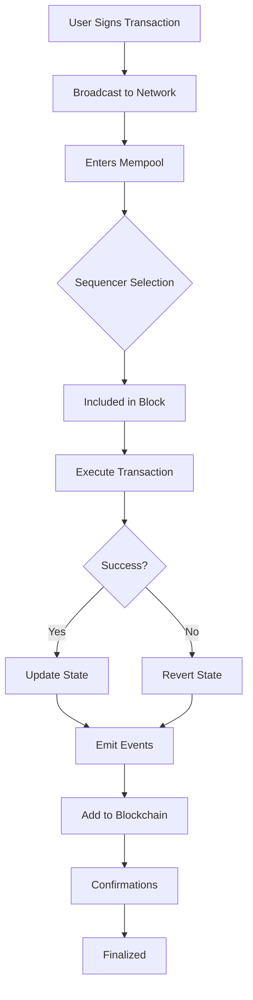

## Overview

This guide explains the transaction flow process on Paxeer Network from submission to finality.

## Transaction Lifecycle

<Steps>
  <Step title="Transaction Created">
    User creates and signs a transaction
    
    ```javascript
    const tx = await signer.sendTransaction({
      to: '0x...',
      value: ethers.parseEther('1.0'),
    });
    ```
  </Step>

  <Step title="Submitted to Mempool">
    Transaction is broadcast to the network and enters the mempool
    
    **Status:** Pending
    
    ```javascript
    console.log('Transaction hash:', tx.hash);
    // Transaction is now in mempool
    ```
  </Step>

  <Step title="Sequencer Selection">
    Sequencer selects transactions based on:
    - Gas price (base fee + priority fee)
    - Nonce order
    - Transaction dependencies
    
    **Priority:** Higher priority fee = faster inclusion
  </Step>

  <Step title="Block Inclusion">
    Transaction is included in a block
    
    **Block Time:** ~2 seconds
    
    ```javascript
    const receipt = await tx.wait(1);
    console.log('Mined in block:', receipt.blockNumber);
    ```
  </Step>

  <Step title="Execution">
    Transaction is executed, state is updated
    
    **Result:** Success (status: 1) or Failure (status: 0)
    
    ```javascript
    if (receipt.status === 1) {
      console.log('Transaction successful!');
    }
    ```
  </Step>

  <Step title="Finalization">
    After multiple confirmations, transaction is finalized
    
    **Recommended Confirmations:** 12+ blocks (~24 seconds)
    
    ```javascript
    const receipt = await tx.wait(12);
    console.log('Transaction finalized!');
    ```
  </Step>
</Steps>

## Detailed Flow Diagram



## Transaction States

<Tabs>
  <Tab title="Pending">
    ### Pending State
    
    Transaction is in the mempool waiting to be included.
    
    **Characteristics:**
    - Not yet in a block
    - Can be replaced (with higher fee)
    - Can be dropped if mempool is full
    - No guarantee of inclusion
    
    **Check Status:**
    ```javascript
    const tx = await provider.getTransaction(txHash);
    if (!tx.blockNumber) {
      console.log('Transaction is pending');
    }
    ```
  </Tab>

  <Tab title="Mined">
    ### Mined State
    
    Transaction is included in a block but not yet confirmed.
    
    **Characteristics:**
    - Included in a block
    - State changes applied
    - Can still be reorganized
    - 1+ confirmations
    
    **Check Status:**
    ```javascript
    const receipt = await provider.getTransactionReceipt(txHash);
    if (receipt && receipt.blockNumber) {
      console.log('Transaction mined in block:', receipt.blockNumber);
      console.log('Status:', receipt.status === 1 ? 'Success' : 'Failed');
    }
    ```
  </Tab>

  <Tab title="Confirmed">
    ### Confirmed State
    
    Transaction has received multiple confirmations.
    
    **Characteristics:**
    - 3+ confirmations
    - Very unlikely to be reorganized
    - Safe for most use cases
    
    **Check Confirmations:**
    ```javascript
    const currentBlock = await provider.getBlockNumber();
    const receipt = await provider.getTransactionReceipt(txHash);
    const confirmations = currentBlock - receipt.blockNumber + 1;
    
    console.log('Confirmations:', confirmations);
    ```
  </Tab>

  <Tab title="Finalized">
    ### Finalized State
    
    Transaction is considered final and irreversible.
    
    **Characteristics:**
    - 12+ confirmations (~24 seconds)
    - Extremely unlikely to be reorganized
    - Safe for financial operations
    
    **Recommended For:**
    - Large transfers
    - Critical state changes
    - Irreversible actions
  </Tab>
</Tabs>

## Sequencer Role

The sequencer is responsible for:

1. **Ordering Transactions**
   - Selects from mempool based on fees
   - Maintains nonce order per account
   - Prioritizes higher fee transactions

2. **Creating Blocks**
   - Bundles transactions into blocks
   - ~2 second block time target
   - Maximum 30M gas per block

3. **Executing Transactions**
   - Runs EVM execution
   - Updates state
   - Emits events

4. **Maintaining State**
   - Stores current blockchain state
   - Provides state access via RPC
   - Ensures consistency

## Transaction Ordering

Transactions in the mempool are ordered by:

<Steps>
  <Step title="Priority Fee">
    Higher priority fee = higher priority
    
    ```javascript
    // High priority transaction
    maxPriorityFeePerGas: ethers.parseUnits('5', 'gwei')
    
    // Low priority transaction
    maxPriorityFeePerGas: ethers.parseUnits('1', 'gwei')
    ```
  </Step>

  <Step title="Nonce Order">
    Transactions from same address must be sequential
    
    ```javascript
    // These must execute in order
    await signer.sendTransaction({ ...tx, nonce: 10 });
    await signer.sendTransaction({ ...tx, nonce: 11 });
    await signer.sendTransaction({ ...tx, nonce: 12 });
    ```
  </Step>

  <Step title="Gas Price">
    Base fee + priority fee determines total priority
    
    ```javascript
    effectivePriority = baseFee + priorityFee
    ```
  </Step>
</Steps>

## Block Production

### Block Structure

```javascript
{
  "number": 1234567,
  "hash": "0x...",
  "parentHash": "0x...",
  "timestamp": 1699564800,
  "gasLimit": "30000000",
  "gasUsed": "15234567",
  "baseFeePerGas": "1000000000", // 1 gwei
  "transactions": [
    "0x...", // Transaction hashes
    "0x...",
  ],
  "miner": "0x..." // Sequencer address
}
```

### Block Time

**Target:** ~2 seconds per block

**Factors affecting block time:**
- Network congestion
- Transaction complexity
- Sequencer performance

## State Management

### State Transitions

```solidity
// Before transaction
state[address].balance = 100 PAX

// Transaction: transfer 10 PAX
transfer(recipient, 10 PAX)

// After transaction
state[address].balance = 90 PAX
state[recipient].balance = originalBalance + 10 PAX
```

### State Root

Each block contains a state root (Merkle root):

```javascript
{
  "stateRoot": "0x...", // Merkle root of entire state
  "receiptsRoot": "0x...", // Root of transaction receipts
  "transactionsRoot": "0x..." // Root of transactions
}
```

## Confirmations and Finality

### Confirmation Levels

| Confirmations | Time | Risk | Use Case |
|---------------|------|------|----------|
| 0 (Pending) | 0s | High | UI preview only |
| 1 | ~2s | Medium | Small transactions |
| 3 | ~6s | Low | Standard transactions |
| 6 | ~12s | Very Low | Important transactions |
| 12+ | ~24s | Minimal | Critical/irreversible |

### Checking Finality

```javascript
async function isTransactionFinalized(txHash, requiredConfirmations = 12) {
  const receipt = await provider.getTransactionReceipt(txHash);
  
  if (!receipt) {
    return { finalized: false, confirmations: 0 };
  }
  
  const currentBlock = await provider.getBlockNumber();
  const confirmations = currentBlock - receipt.blockNumber + 1;
  
  return {
    finalized: confirmations >= requiredConfirmations,
    confirmations: confirmations,
    blockNumber: receipt.blockNumber,
  };
}

// Usage
const status = await isTransactionFinalized('0x...');
console.log('Finalized:', status.finalized);
console.log('Confirmations:', status.confirmations);
```

## Transaction Types

### Standard Transfer

```javascript
{
  type: 2, // EIP-1559
  to: '0x...',
  value: ethers.parseEther('1.0'),
  maxFeePerGas: ethers.parseUnits('2', 'gwei'),
  maxPriorityFeePerGas: ethers.parseUnits('1', 'gwei'),
  gasLimit: 21000,
}
```

### Contract Deployment

```javascript
{
  type: 2,
  data: '0x608060...', // Contract bytecode
  maxFeePerGas: ethers.parseUnits('2', 'gwei'),
  maxPriorityFeePerGas: ethers.parseUnits('1', 'gwei'),
  gasLimit: 3000000,
}
```

### Contract Interaction

```javascript
{
  type: 2,
  to: contractAddress,
  data: contract.interface.encodeFunctionData('transfer', [recipient, amount]),
  maxFeePerGas: ethers.parseUnits('2', 'gwei'),
  maxPriorityFeePerGas: ethers.parseUnits('1', 'gwei'),
  gasLimit: 100000,
}
```

## Monitoring Transactions

### Real-time Monitoring

```javascript
// Listen for pending transactions
provider.on('pending', (txHash) => {
  console.log('New pending tx:', txHash);
});

// Listen for mined blocks
provider.on('block', async (blockNumber) => {
  const block = await provider.getBlock(blockNumber);
  console.log('New block:', blockNumber);
  console.log('Transactions:', block.transactions.length);
  console.log('Gas used:', block.gasUsed.toString());
});
```

### Transaction Receipts

```javascript
const receipt = await provider.getTransactionReceipt(txHash);

console.log({
  status: receipt.status, // 1 = success, 0 = failed
  blockNumber: receipt.blockNumber,
  gasUsed: receipt.gasUsed.toString(),
  effectiveGasPrice: receipt.gasPrice.toString(),
  logs: receipt.logs, // Event logs
  from: receipt.from,
  to: receipt.to,
  contractAddress: receipt.contractAddress, // If deployment
});
```

## Performance Metrics

### Network Statistics

| Metric | Value |
|--------|-------|
| Average Block Time | ~2 seconds |
| Block Gas Limit | 30,000,000 |
| Typical Base Fee | 1-5 gwei |
| Transactions/Second | ~1,500 TPS |
| Finality Time | ~24 seconds (12 blocks) |

## Resources

<CardGroup cols={2}>
  <Card
    title="Transaction Fees"
    icon="money-bill"
    href="/app-developers/guides/transactions/fees"
  >
    Understand fee structure
  </Card>
  <Card
    title="Transaction Status"
    icon="list-check"
    href="/app-developers/guides/transactions/statuses"
  >
    Track transaction states
  </Card>
  <Card
    title="Troubleshooting"
    icon="wrench"
    href="/app-developers/guides/transactions/troubleshooting"
  >
    Fix transaction issues
  </Card>
  <Card
    title="API Reference"
    icon="book"
    href="/api-reference"
  >
    RPC method documentation
  </Card>
</CardGroup>

